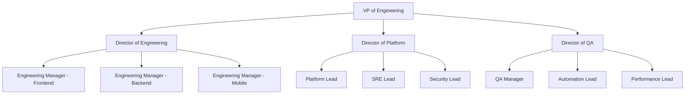

# Team Structure and Organization

## Overview

Our engineering organization is structured to promote efficiency, innovation, and clear communication while maintaining high standards of technical excellence.

## Organization Chart

## Teams and Responsibilities

### Product Engineering

#### Frontend Team
- **Size**: 8 engineers
- **Tech Stack**: React, TypeScript, GraphQL
- **Focus Areas**:
  - User interface development
  - Client-side architecture
  - Performance optimization
  - Accessibility compliance

#### Backend Team
- **Size**: 10 engineers
- **Tech Stack**: Python, Node.js, PostgreSQL
- **Focus Areas**:
  - API development
  - Data modeling
  - Service architecture
  - Integration management

#### Mobile Team
- **Size**: 6 engineers
- **Tech Stack**: Swift, Kotlin, React Native
- **Focus Areas**:
  - iOS development
  - Android development
  - Cross-platform features
  - Mobile performance

### Platform Engineering

#### Infrastructure Team
- **Size**: 6 engineers
- **Tech Stack**: Kubernetes, Terraform, AWS
- **Focus Areas**:
  - Cloud infrastructure
  - Deployment automation
  - Scaling and optimization
  - Cost management

#### SRE Team
- **Size**: 5 engineers
- **Tech Stack**: Prometheus, Grafana, ELK
- **Focus Areas**:
  - System reliability
  - Monitoring and alerting
  - Incident response
  - Performance optimization

#### Security Team
- **Size**: 4 engineers
- **Tech Stack**: Various security tools
- **Focus Areas**:
  - Security architecture
  - Vulnerability management
  - Compliance
  - Security automation

### Quality Assurance

#### QA Engineering
- **Size**: 6 engineers
- **Tech Stack**: Selenium, Cypress, JMeter
- **Focus Areas**:
  - Test automation
  - Quality processes
  - Test coverage
  - Bug management

#### Performance Engineering
- **Size**: 3 engineers
- **Tech Stack**: JMeter, K6, Lighthouse
- **Focus Areas**:
  - Load testing
  - Performance monitoring
  - Optimization
  - Benchmarking

## Roles and Responsibilities

### Leadership Roles

#### VP of Engineering
- Strategic planning
- Resource allocation
- Technology roadmap
- Stakeholder management

#### Directors
- Team management
- Project oversight
- Process improvement
- Technical direction

#### Engineering Managers
- Team leadership
- Career development
- Sprint management
- Resource planning

### Technical Roles

#### Technical Leads
- Architecture design
- Technical decisions
- Code quality
- Mentorship

#### Senior Engineers
- Complex features
- System design
- Code review
- Technical guidance

#### Engineers
- Feature development
- Bug fixes
- Testing
- Documentation

## Communication Channels

### Regular Meetings

#### All Hands
- **Frequency**: Monthly
- **Duration**: 1 hour
- **Participants**: All engineering
- **Purpose**: Updates and alignment

#### Tech Sync
- **Frequency**: Weekly
- **Duration**: 1 hour
- **Participants**: Tech leads
- **Purpose**: Technical coordination

#### Team Standups
- **Frequency**: Daily
- **Duration**: 15 minutes
- **Participants**: Team members
- **Purpose**: Daily coordination

### Communication Tools

#### Synchronous
- Slack for instant messaging
- Zoom for video calls
- Phone for emergencies

#### Asynchronous
- Email for formal communication
- JIRA for task tracking
- Confluence for documentation

## Career Development

### Career Paths

#### Individual Contributor Track
1. Engineer I
2. Engineer II
3. Senior Engineer
4. Staff Engineer
5. Principal Engineer
6. Distinguished Engineer

#### Management Track
1. Team Lead
2. Engineering Manager
3. Senior Engineering Manager
4. Director of Engineering
5. VP of Engineering

### Skill Matrix

#### Technical Skills
- Programming languages
- System design
- Architecture patterns
- Testing methodologies
- DevOps practices

#### Soft Skills
- Communication
- Leadership
- Problem-solving
- Collaboration
- Time management

## Team Processes

### Development Workflow

#### Planning
1. Backlog refinement
2. Sprint planning
3. Task assignment
4. Estimation

#### Execution
1. Development
2. Code review
3. Testing
4. Documentation

#### Delivery
1. Staging deployment
2. QA verification
3. Production release
4. Monitoring

### Code Review Process

#### Guidelines
- 2 approvals required
- Maximum 24h turnaround
- Technical lead review
- Automated checks

#### Review Criteria
- Code quality
- Test coverage
- Performance impact
- Security considerations

## On-Call Rotation

### Primary On-Call
- Week-long rotation
- 24/7 availability
- Incident response
- Problem resolution

### Secondary On-Call
- Backup support
- Specialty expertise
- Escalation path
- Knowledge sharing

## Team Events

### Regular Events

#### Tech Talks
- **Frequency**: Bi-weekly
- **Duration**: 1 hour
- **Topics**: Technical deep dives
- **Format**: Presentation + Q&A

#### Hackathons
- **Frequency**: Quarterly
- **Duration**: 2 days
- **Focus**: Innovation
- **Outcome**: Prototypes

#### Team Building
- **Frequency**: Monthly
- **Type**: Social activities
- **Purpose**: Team bonding
- **Participation**: Optional

## Support and Escalation

### Support Tiers

#### Tier 1
- First response
- Basic troubleshooting
- Issue documentation
- Initial triage

#### Tier 2
- Technical investigation
- Problem resolution
- Service restoration
- Root cause analysis

#### Tier 3
- Expert consultation
- Complex problems
- Architecture changes
- Security incidents

### Escalation Path
1. On-call engineer
2. Technical lead
3. Engineering manager
4. Director
5. VP of Engineering

## Appendix

### Quick Links
- Team Calendar
- Contact Directory
- Documentation
- Tools Access

### Templates
- Design Documents
- Status Reports
- Meeting Notes
- Review Checklists

### Team Resources
- Training Materials
- Process Documents
- Tool Guides
- Best Practices