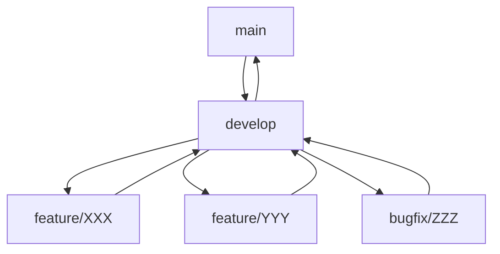
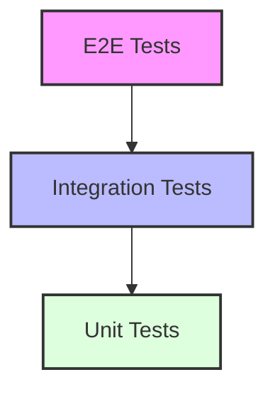

# Development Workflow

## Overview

This document outlines our team's development workflow, from idea conception to production deployment. Our process is designed to ensure high-quality code delivery while maintaining rapid development cycles.

## Development Lifecycle

### 1. Planning Phase

#### Feature Planning
1. **Refinement**
   - Review acceptance criteria
   - Technical discussion
   - Estimate complexity
   - Break down into tasks

2. **Documentation**
   - Technical design document
   - API specifications
   - Database schema changes
   - Security considerations

### 2. Development Phase

#### Branch Strategy



#### Branch Naming
- Features: `feature/JIRA-123-short-description`
- Bugs: `bugfix/JIRA-456-short-description`
- Hotfixes: `hotfix/JIRA-789-short-description`

#### Commit Standards
```bash
# Format
<type>(<scope>): <subject>

# Types
feat: New feature
fix: Bug fix
docs: Documentation
style: Formatting
refactor: Code restructuring
test: Adding tests
chore: Maintenance

# Example
feat(auth): implement OAuth2 login
```

### 3. Code Review Process

#### Pull Request Template
```markdown
## Description
[Description of changes]

## Type of Change
- [ ] Bug fix
- [ ] New feature
- [ ] Breaking change
- [ ] Documentation update

## Testing
- [ ] Unit tests
- [ ] Integration tests
- [ ] Manual testing

## Checklist
- [ ] Code follows style guidelines
- [ ] Comments are clear and useful
- [ ] Documentation is updated
- [ ] Tests are added/updated
- [ ] Changelog is updated
```

#### Review Guidelines
1. **Code Quality**
   - Follows style guide
   - Properly documented
   - Error handling
   - Performance considerations

2. **Testing**
   - Unit tests
   - Integration tests
   - Edge cases covered
   - Performance tests

3. **Security**
   - Input validation
   - Authentication/Authorization
   - Data protection
   - Secure communications

### 4. Testing Strategy

#### Test Pyramid


#### Test Types
1. **Unit Tests**
   - Function level
   - Mocked dependencies
   - Fast execution
   - Code coverage > 80%

2. **Integration Tests**
   - Service level
   - Database operations
   - API endpoints
   - External services

3. **E2E Tests**
   - User workflows
   - UI interactions
   - Critical paths
   - Performance testing

### 5. Deployment Process

#### Environments
1. **Development**
   - Continuous deployment
   - Feature testing
   - Integration testing

2. **Staging**
   - Release candidates
   - Performance testing
   - User acceptance

3. **Production**
   - Controlled releases
   - Monitored deployment
   - Rollback capability

#### Deployment Checklist
```markdown
## Pre-Deployment
- [ ] All tests passing
- [ ] Documentation updated
- [ ] Release notes prepared
- [ ] Database migrations ready
- [ ] Backup verification

## Deployment
- [ ] Service health check
- [ ] Database migration
- [ ] Cache warming
- [ ] Feature flag update
- [ ] Monitoring active

## Post-Deployment
- [ ] Smoke tests
- [ ] Error rate monitoring
- [ ] Performance metrics
- [ ] User feedback
- [ ] Rollback readiness
```

## Tools & Infrastructure

### Development Tools
- **IDE**: VS Code
- **VCS**: Git + GitHub
- **CI/CD**: GitHub Actions
- **Code Quality**: SonarQube
- **Package Manager**: npm/pip

### Infrastructure
- **Cloud**: AWS
- **Containers**: Docker
- **Orchestration**: Kubernetes
- **Database**: PostgreSQL
- **Caching**: Redis

### Monitoring
- **APM**: New Relic
- **Logs**: ELK Stack
- **Metrics**: Prometheus
- **Dashboards**: Grafana

## Best Practices

### Code Quality
1. **Clean Code**
   - Meaningful names
   - Single responsibility
   - DRY principle
   - SOLID principles

2. **Documentation**
   - Code comments
   - API documentation
   - Architecture diagrams
   - Setup guides

3. **Performance**
   - Optimization techniques
   - Caching strategies
   - Database indexing
   - Load testing

### Security
1. **Code Security**
   - OWASP guidelines
   - Dependency scanning
   - Security testing
   - Access control

2. **Data Protection**
   - Encryption
   - Input validation
   - Output encoding
   - Secure protocols

## Continuous Improvement

### Metrics
- Deployment frequency
- Lead time for changes
- Change failure rate
- Time to restore service

### Regular Reviews
- Code quality metrics
- Performance trends
- Security assessments
- Process efficiency

### Knowledge Sharing
- Tech talks
- Pair programming
- Documentation updates
- Team workshops

## Appendix

### Quick References
- [Git Cheat Sheet](link)
- [Style Guide](link)
- [API Documentation](link)
- [Architecture Diagram](link)

### Templates
- Pull Request Template
- Technical Design Doc
- Release Notes
- Incident Reports

### Tools Setup
- Development Environment
- Testing Framework
- CI/CD Pipeline
- Monitoring Stack