# Release Calendar and Schedule

## Release Cadence

Our team follows a structured release schedule to ensure consistent, predictable delivery of new features and improvements while maintaining system stability.

### Regular Release Schedule

#### Production Releases
- **Frequency**: Every 2 weeks
- **Day**: Wednesday
- **Time**: 10:00 UTC
- **Duration**: 1-2 hours

#### Hotfix Schedule
- **Frequency**: As needed
- **Approval Required**: Yes
- **Min. Notice**: 1 hour
- **Change Board**: On-call + Team Lead

## Q4 2025 Release Calendar

### October 2025

#### Release 2025.10.2
- **Date**: October 2, 2025
- **Type**: Regular Release
- **Features**:
  - Authentication service upgrade
  - New API endpoints
  - Performance improvements
- **Owner**: @release-manager

#### Release 2025.10.16
- **Date**: October 16, 2025
- **Type**: Regular Release
- **Features**:
  - UI/UX enhancements
  - Database optimizations
  - New analytics features
- **Owner**: @release-manager

#### Release 2025.10.30
- **Date**: October 30, 2025
- **Type**: Regular Release
- **Features**:
  - Security updates
  - API version 2.0
  - Cache improvements
- **Owner**: @release-manager

### November 2025

#### Release 2025.11.13
- **Date**: November 13, 2025
- **Type**: Regular Release
- **Features**:
  - Mobile app integration
  - Payment system upgrade
  - Performance optimization
- **Owner**: @release-manager

#### Release 2025.11.27
- **Date**: November 27, 2025
- **Type**: Regular Release
- **Features**:
  - New dashboard features
  - Reporting improvements
  - Infrastructure updates
- **Owner**: @release-manager

### December 2025

#### Release 2025.12.11
- **Date**: December 11, 2025
- **Type**: Regular Release
- **Features**:
  - Year-end updates
  - System optimization
  - Security enhancements
- **Owner**: @release-manager

#### Release 2025.12.18
- **Date**: December 18, 2025
- **Type**: Final Release of 2025
- **Features**:
  - Critical fixes only
  - Performance tuning
  - Stability improvements
- **Owner**: @release-manager

## Release Process

### Pre-Release Tasks

#### 1 Week Before
- [ ] Feature freeze
- [ ] Release branch created
- [ ] QA environment updated
- [ ] Test execution starts

#### 2 Days Before
- [ ] Release notes drafted
- [ ] Stakeholder review
- [ ] Final QA sign-off
- [ ] Deployment plan review

#### Day Before
- [ ] Change board approval
- [ ] Communication prepared
- [ ] On-call schedule confirmed
- [ ] Rollback plan verified

### Release Day Schedule

#### Pre-Deployment (T-2h)

```mermaid
gantt
    title Release Day Timeline
    dateFormat HH:mm
    axisFormat %H:%M
    
    section Preparation
    Team Sync           :08:00, 15m
    Environment Check   :08:15, 15m
    Backup Verification :08:30, 15m
    
    section Deployment
    Deploy to Prod     :09:00, 30m
    Smoke Tests        :09:30, 15m
    Monitoring         :09:45, 15m
    
    section Verification
    Final Checks       :10:00, 15m
    User Verification  :10:15, 15m
    Release Complete   :10:30, 0m
```


### Post-Release Tasks

#### Immediate
- [ ] Verify all services
- [ ] Monitor error rates
- [ ] Check user feedback
- [ ] Confirm metrics

#### Within 24 Hours
- [ ] Release retrospective
- [ ] Update documentation
- [ ] Close release ticket
- [ ] Plan next release

## Communication Plan

### Internal Updates

#### Pre-Release
```markdown
🚀 Release 2025.XX.XX Scheduled
- Date: [Date]
- Time: [Time] UTC
- Duration: ~2 hours
- Features: [Key Features]
- Owner: @release-manager
```

#### During Release
```markdown
🔄 Release 2025.XX.XX Status
- Stage: [Current Stage]
- Progress: [Progress %]
- Status: [On Track/Delayed]
- Issues: [Any Issues]
```

#### Post-Release
```markdown
✅ Release 2025.XX.XX Complete
- Status: Successful
- Time: [Completion Time]
- Notes: [Important Notes]
- Next Release: [Next Date]
```

### External Communication

#### Release Announcement
```markdown
📢 Scheduled Maintenance
We will be performing a scheduled release on [Date] at [Time] UTC.
Duration: Approximately 2 hours
Impact: Minimal disruption expected
Updates: Follow our status page
```

## Release Artifacts

### Required Documents
1. **Release Notes**
   - Features included
   - Bug fixes
   - Known issues
   - Upgrade notes

2. **Deployment Plan**
   - Step-by-step process
   - Rollback procedures
   - Verification steps
   - Contact information

3. **Test Results**
   - Test coverage
   - Performance results
   - Security scan
   - Integration tests

## Compliance & Auditing

### Release Records
- Release version
- Deployment time
- Changes included
- Approvers
- Test results

### Audit Requirements
1. **Documentation**
   - Change requests
   - Approval records
   - Test evidence
   - Release notes

2. **Metrics**
   - Deployment success
   - Rollback rate
   - Incident count
   - Customer impact

## Special Considerations

### Holiday Schedule
- Avoid major releases
- Limited to critical fixes
- Extended testing required
- Additional approvals needed

### Emergency Releases
- Security patches
- Critical bug fixes
- Data fixes
- System recovery

## Appendix

### Quick Links
- [Release Dashboard](link)
- [Change Calendar](link)
- [Test Results](link)
- [Documentation](link)

### Contact Information
- Release Manager: @release-manager
- Technical Lead: @tech-lead
- QA Lead: @qa-lead
- Support Team: @support-team

### Templates
- Release Notes
- Deployment Plan
- Communication
- Retrospective